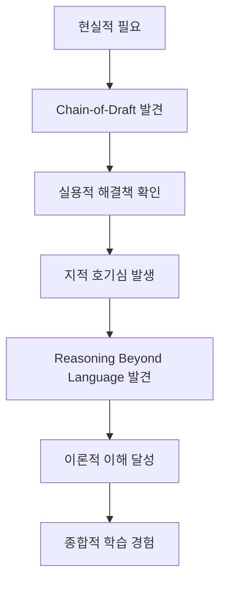
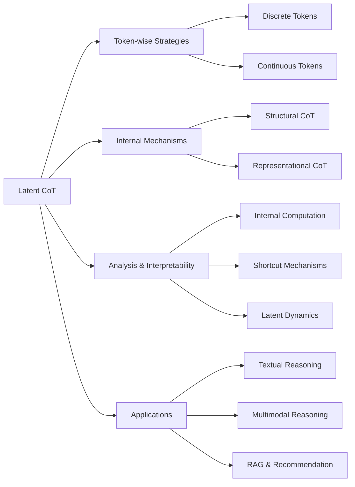
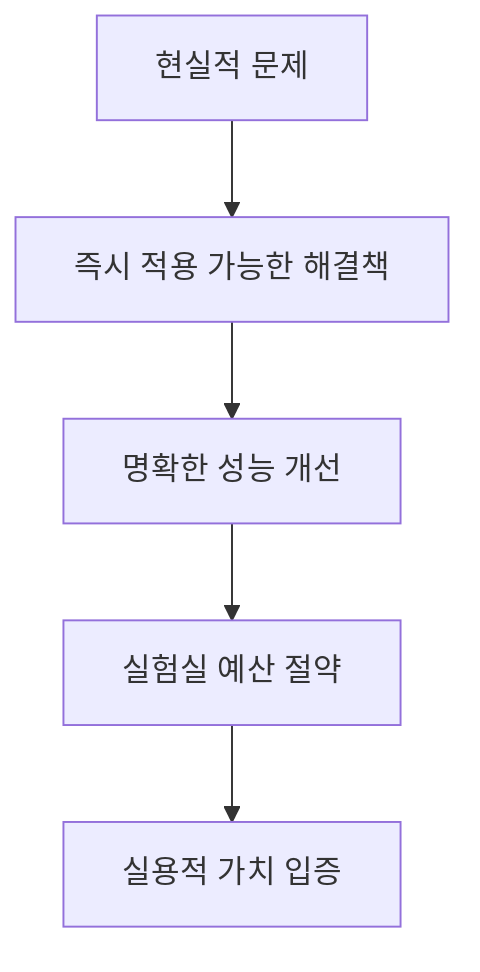
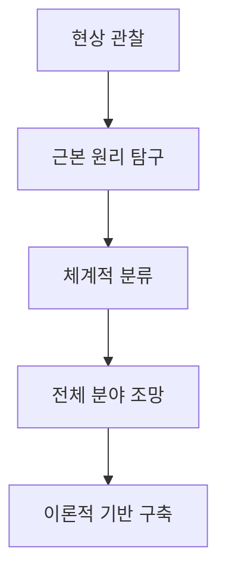
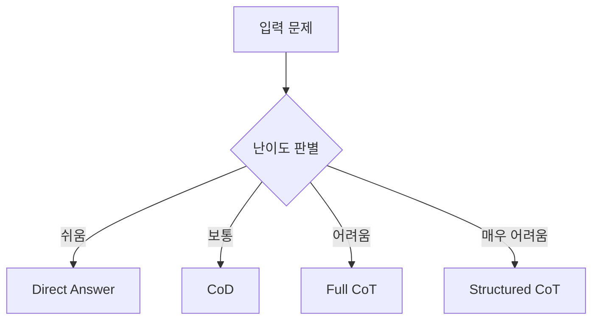

# 논문 연구 발표: 효율적 AI 추론의 실용적 접근과 이론적 탐구

## 📋 발표 개요

### 발표 주제

**"Chain-of-Draft와 Reasoning Beyond Language: 실용성에서 시작해 이론으로 확장된 AI 추론 연구 여정"**

### 발표 목적

-   제한된 자원 환경에서의 AI 효율성 개선 방안 탐구
-   실용적 문제 해결에서 이론적 이해로 확장되는 연구 방법론 소개
-   최신 AI 추론 기법의 현황과 미래 전망 제시

### 발표 시간

50분 (질의응답 포함)

---

## 🎯 1. 연구 동기 및 배경

### 1.1 현실적 제약사항들

현대 AI 연구자들이 직면한 공통적인 문제들:

**🔴 기술적 제약**

-   **제한된 GPU 자원**: 대규모 모델 학습/fine-tuning의 어려움
-   **API 비용 부담**: 연구 예산 대비 높은 클라우드 서비스 비용
-   **추론 지연**: 실시간 응용에서의 성능 병목
-   **토큰 비용**: CoT 방식의 장황한 설명으로 인한 비용 증가

**🔴 실용적 요구**

-   즉시 적용 가능한 기술 필요
-   복잡한 셋업 없이 테스트 가능한 방법론
-   제한된 환경에서도 의미 있는 결과 도출
-   이론과 실무의 균형

### 1.2 연구 질문

**핵심 질문**: "어떤 논문이 우리에게 실질적인 도움이 될까?"

**세부 질문들**:

1. 제한된 자원으로도 성능을 향상시킬 수 있는 방법은?
2. 효율성과 정확도를 동시에 달성할 수 있는가?
3. 이런 현상의 이론적 배경은 무엇인가?
4. 다른 연구자들은 어떤 관점에서 접근하고 있는가?

---

## 📊 2. 논문 선정 과정

### 2.1 선정 기준 정립

| 기준                 | 설명                              | 중요도     |
| -------------------- | --------------------------------- | ---------- |
| **즉시 적용 가능성** | 복잡한 셋업 없이 바로 테스트 가능 | ⭐⭐⭐⭐⭐ |
| **자원 효율성**      | 제한된 환경에서도 의미 있는 결과  | ⭐⭐⭐⭐⭐ |
| **실용적 가치**      | 실제 문제 해결에 도움             | ⭐⭐⭐⭐   |
| **학습 가치**        | 연구 역량 향상에 기여             | ⭐⭐⭐⭐   |

### 2.2 발견 과정

**🔍 첫 번째 발견: Chain-of-Draft**

-   검색 키워드: "efficient reasoning", "token reduction"
-   제목의 직관성: "Thinking Faster by Writing Less"
-   즉각적인 실용성 확인

**🤔 두 번째 의문 발생**

-   CoD가 작동하는 이유는?
-   이론적 배경은 무엇인가?
-   비슷한 연구들이 있을까?

**🔍 두 번째 발견: Reasoning Beyond Language**

-   검색 키워드: "latent reasoning", "compressed thinking"
-   체계적인 survey 논문 발견
-   이론적 프레임워크 제공

### 2.3 두 논문의 시너지



---

## 🚀 3. Chain-of-Draft: 실용적 해결책

### 3.1 논문 개요

**기본 정보**

-   **저자**: Silei Xu, Wenhao Xie, Lingxiao Zhao, Pengcheng He
-   **소속**: Zoom Communications
-   **출처**: arXiv:2502.18600

**핵심 아이디어**

> 각 추론 단계를 최대 5단어로 제한하여 간결한 초안(draft) 형태로 사고 과정을 압축

### 3.2 방법론 비교

#### Standard 방식

```
Q: Jason had 20 lollipops. He gave Denny some lollipops.
   Now Jason has 12 lollipops. How many lollipops did Jason give to Denny?
A: 8
```

#### Chain-of-Thought 방식

```
Q: Jason had 20 lollipops. He gave Denny some lollipops.
   Now Jason has 12 lollipops. How many lollipops did Jason give to Denny?
A: Let's think through this step by step:
   1. Initially, Jason had 20 lollipops.
   2. After giving some to Denny, Jason now has 12 lollipops.
   3. To find out how many lollipops Jason gave to Denny, we need to
      calculate the difference between the initial number of lollipops
      and the remaining number.
   4. We can set up a simple subtraction problem: Initial number of
      lollipops - Remaining number of lollipops = Lollipops given to Denny
   5. Putting in the numbers: 20 - 12 = Lollipops given to Denny
   6. Solving the subtraction: 20 - 12 = 8
   Therefore, Jason gave 8 lollipops to Denny.
```

#### Chain-of-Draft 방식

```
Q: Jason had 20 lollipops. He gave Denny some lollipops.
   Now Jason has 12 lollipops. How many lollipops did Jason give to Denny?
A: 20 - x = 12; x = 20 - 12 = 8. #### 8
```

### 3.3 실험 결과

#### 🧮 산술 추론 (GSM8K)

| Model                 | Prompt   | Accuracy  | Token #  | Token 절약  | Latency  |
| --------------------- | -------- | --------- | -------- | ----------- | -------- |
| **GPT-4o**            |          |           |          |             |          |
|                       | Standard | 53.3%     | 1.1      | -           | 0.6s     |
|                       | CoT      | 95.4%     | 205.1    | -           | 4.2s     |
|                       | **CoD**  | **91.1%** | **43.9** | **🔥78.6%** | **1.0s** |
| **Claude 3.5 Sonnet** |          |           |          |             |          |
|                       | Standard | 64.6%     | 1.1      | -           | 0.9s     |
|                       | CoT      | 95.8%     | 190.0    | -           | 3.1s     |
|                       | **CoD**  | **91.4%** | **39.8** | **🔥79.1%** | **1.6s** |

**핵심 성과**:

-   ✅ **정확도**: CoT 대비 90% 이상 유지
-   ✅ **효율성**: 토큰 사용량 80% 절약
-   ✅ **속도**: 추론 시간 2-4배 단축

#### 🧠 상식 추론

**Date Understanding**

```
Q: Yesterday was April 30, 2021. What is the date tomorrow?
CoT: Let me think through this step by step...
     [장황한 설명 172.5 tokens]
CoD: April 30 + 1 = May 1; tomorrow = May 2. #### May 2, 2021
     [간결한 설명 31.3 tokens]
```

**Sports Understanding**

```
Q: Which sport uses a round ball?
CoT: Let me consider various sports...
     [자세한 분석 189.4 tokens]
CoD: Round ball → basketball, soccer, volleyball. #### Basketball
     [핵심만 14.3 tokens]
```

#### 🔄 기호적 추론 (Coin Flip)

```
Q: A coin is heads up. Robyn flips the coin. Peggy flips the coin.
   Grant flips the coin. Vanessa does not flip the coin.
   Is the coin still heads up?

CoT: Let me track each flip carefully...
     Initially: Heads
     After Robyn: Tails
     After Peggy: Heads
     After Grant: Tails
     Vanessa doesn't flip, so final state: Tails
     [상세 설명 135.3 tokens]

CoD: H→T→H→T; 3 flips = odd. #### No
     [핵심만 18.9 tokens]
```

### 3.4 CoD의 한계

#### 🚨 Few-shot 의존성

**Zero-shot 성능 저하**:

-   GPT-4o: 94.8% → 84.4% (10.4%p 하락)
-   Claude 3.5: 90.4% → 65.5% (24.9%p 하락)

#### 🚨 소규모 모델 제한

**모델 크기별 성능**:

-   Qwen2.5-1.5B: CoT 32.5% → CoD 24.2%
-   Qwen2.5-3B: CoT 59.1% → CoD 43.1%
-   Llama3.2-3B: CoT 70.7% → CoD 52.5%

**→ 대규모 모델에서만 효과적**

### 3.5 실제 테스트 경험

```python
# 즉석 테스트 결과
기존 CoT: "Think step by step to solve: 15 + 27 = ?"
→ 긴 설명 + 높은 API 비용

CoD: "Think step by step, keep each step to 5 words max: 15 + 27 = ?"
→ "15 + 27 = 42" (간결 + 저비용)
```

**체감 효과**:

-   API 비용 눈에 띄게 감소
-   응답 속도 체감상 2-3배 향상
-   정확도는 거의 동일 유지

---

## 🔬 4. Reasoning Beyond Language: 이론적 배경

### 4.1 논문 개요

**기본 정보**

-   **저자**: Xinghao Chen, Anhao Zhao, Heming Xia 외
-   **소속**: The Hong Kong Polytechnic University
-   **출처**: arXiv:2505.16782

**핵심 메시지**

> "추론을 언어로부터 분리함으로써, 잠재 추론은 더 풍부한 인지적 표현과 더 유연하고 빠른 추론을 보장"

### 4.2 명시적 CoT의 근본적 한계

#### 🔴 계산 비효율성

```
명시적 CoT의 문제:
"Let me think through this step by step:
First, I need to understand what the question is asking.
Then, I should identify the relevant information.
Next, I will apply the appropriate mathematical operation.
Finally, I will verify my answer makes sense."

→ 정보 없는 토큰들이 대부분
→ 계산 자원 낭비
```

#### 🔴 언어의 본질적 한계

**비트겐슈타인의 철학적 통찰**:

> "Whereof one cannot speak, thereof one must be silent."

**인간 사고의 특성**:

-   추상적 통찰 (언어화 어려움)
-   직관적 도약 (논리적 설명 불가)
-   고도로 구성적인 사고 (언어 표현의 한계)

### 4.3 Latent CoT의 분류 체계

#### 📊 4가지 관점의 통합 분류



### 4.4 토큰 단위 전략 (Token-wise Strategies)

#### 🔹 이산 토큰 (Discrete Tokens)

**CoD의 위치**: 이산 토큰 전략의 한 구현체

**다른 유사 기법들**:

-   **Pause Tokens**: `[PAUSE]`, `[THINK]` 마커 사용
-   **Quiet-STaR**: 학습된 특수 토큰으로 숨겨진 추론 표시
-   **Planning Tokens**: 계획 수립용 특별 토큰

#### 🔹 연속 토큰 (Continuous Tokens)

**내재적 방법**:

-   **COCONUT**: 마지막 은닉상태를 입력으로 피드백
-   **LightThinker**: 핵심만 요약 토큰으로 압축

**보조적 방법**:

-   **SoftCoT**: 프롬프트 튜닝으로 소프트 토큰 생성
-   **HCoT**: 보조 모델이 사고 과정을 압축된 벡터로 표현

### 4.5 내부 메커니즘 (Internal Mechanisms)

#### 🏗️ 구조적 CoT (Structural CoT)

**핵심 개념**: 모델 아키텍처 자체를 변경하여 다단계 추론 구현

```python
# 개념적 예시
class StructuralCoT:
    def forward(self, input):
        hidden = input
        for step in range(num_reasoning_steps):
            hidden = self.reasoning_layer(hidden)  # 동일 레이어 반복
        return self.output_layer(hidden)
```

**주요 기법들**:

-   **CoTFormer**: Transformer 내부 표현 반복
-   **Looped Transformers**: 루프 구조로 순환 추론
-   **RELAY**: 반복 루프 1회 = 추론 단계 1회

#### 🧠 표현적 CoT (Representational CoT)

**목표**: 추론 능력을 모델 매개변수에 내재화

```python
# 개념적 예시
class RepresentationalCoT:
    def __init__(self):
        # 추론 능력이 모델 가중치에 저장됨
        self.reasoning_weights = self.distill_from_teacher()

    def forward(self, input):
        # 명시적 단계 없이 내적 추론 수행
        return self.reasoning_weights(input)
```

### 4.6 분석 및 해석 가능성

#### 🔍 내부 계산 해석 (Internal Computation Interpretation)

**모델이 진짜 추론하고 있다는 증거들**:

1. **어텐션 패턴 분석**

```
질문: "Paris is the capital of which country?"
Layer 1: [Paris] ← [capital]
Layer 2: [Paris] ← [France]
Layer 3: [country] ← [France]
→ 추론 트리가 내부적으로 형성됨
```

2. **레이어별 처리 과정**

```
Layer 1-3: 정보 수집
Layer 4-6: 관계 추론
Layer 7-9: 답 생성
→ 단계적 추론 회로 발견
```

#### 🚨 지름길 메커니즘 (Shortcut Mechanisms)

**모델이 실제 추론을 건너뛸 수 있다는 증거들**:

1. **조기 답변 현상**

```
문제: "2 + 2 = ?"
Layer 1에서 이미 정답 "4" 활성화
→ 나머지 레이어는 단순 전달?
```

2. **스푸리어스 상관관계**

```
"큰 숫자가 나오면 곱셈 문제일 것이다"
→ 실제 추론 없이 패턴 매칭
```

### 4.7 응용 분야 (Applications)

#### 📝 텍스트 추론

-   수학 문제 풀이
-   상식 추론
-   논리 퍼즐
-   코드 추론

#### 🎯 멀티모달 추론

-   **Heima**: 멀티모달 문제의 중간 과정을 잠재 공간에 요약
-   **XS-CoT**: 음성-언어 간 추론에 반-암시적 형태 적용

#### 🔍 검색 증강 생성 (RAG)

-   검색-추론 단계 압축으로 지연 시간 감소
-   사용자에게 중간 과정 노출 불필요

---

## 🤝 5. 두 논문의 종합적 이해

### 5.1 실용성 + 이론적 이해의 시너지

#### Chain-of-Draft (실용편)



**구체적 기여**:

-   ✅ 토큰 80% 절약
-   ✅ 정확도 90% 이상 유지
-   ✅ 다양한 태스크에서 검증
-   ✅ 연구실 비용 절감

#### Reasoning Beyond Language (이론편)



**구체적 기여**:

-   ✅ CoD의 이론적 배경 제공
-   ✅ 전체 연구 분야 맵핑
-   ✅ 향후 연구 방향 제시
-   ✅ 비판적 사고력 향상

### 5.2 CoD의 이론적 위치 찾기

**Survey 논문을 통한 CoD 재해석**:

1. **분류상 위치**: 토큰 단위 전략 → 이산 토큰 방식
2. **작동 원리**: 언어적 제약을 최소화하여 추론 효율성 달성
3. **한계 이해**: 잠재 공간 활용의 초보적 단계
4. **발전 방향**: 연속 토큰이나 구조적 CoT로 진화 가능

### 5.3 학습 경험의 가치

#### 📚 연구 방법론 학습


#### 🎯 실무 역량 향상

**1단계: 문제 해결 역량**

-   현실적 제약 → 구체적 해결책 도출
-   즉시 적용 → 빠른 피드백 → 개선

**2단계: 이론적 사고**

-   현상 관찰 → 근본 원리 탐구
-   개별 사례 → 일반적 법칙 도출

**3단계: 종합적 이해**

-   실용과 이론의 연결
-   개별 연구의 맥락적 이해

---

## 🔮 6. 미래 연구 방향 및 시사점

### 6.1 기술적 발전 방향

#### 🚀 단기 목표 (1-2년)

**CoD 개선 방향**:

```python
# 현재 CoD
"Think step by step, keep each step to 5 words max"

# 개선된 CoD
"Think step by step, use optimal compression for each reasoning type:
- Math: symbolic notation (≤3 symbols)
- Logic: truth table shortcuts (≤2 steps)
- Common sense: key concept chains (≤4 words)"
```

**Zero-shot 성능 향상**:

-   자동 예시 생성 시스템
-   도메인별 최적화된 프롬프트
-   메타학습 기반 적응형 압축

#### 🔬 중기 목표 (3-5년)

**하이브리드 접근법**:



**적응형 추론 시스템**:

-   문제 복잡도에 따른 자동 전략 선택
-   실시간 비용-성능 최적화
-   사용자 요구사항 기반 커스터마이징

#### 🌟 장기 목표 (5-10년)

**진정한 잠재 추론**:

-   언어를 완전히 우회하는 추론 시스템
-   다차원 추상 공간에서의 사고
-   인간의 직관적 사고 과정 모방

### 6.2 연구 가치와 시사점

#### 💡 방법론적 시사점

**Bottom-up 연구 접근**:

1. 현실적 필요에서 출발
2. 즉시 적용 가능한 해결책 탐색
3. 이론적 배경으로 확장
4. 체계적 이해 구축

**vs. 기존 Top-down 접근**:

1. 이론 연구부터 시작
2. 복잡한 수식과 증명
3. 실용성은 나중에 고려
4. 현실과의 괴리 가능성

### 6.3 AI 분야에 대한 통찰

#### 🔍 효율성의 중요성

**현재 트렌드**:

-   모델 크기 경쟁 → 효율성 경쟁
-   성능 극대화 → 비용 최적화
-   복잡성 추구 → 단순함의 가치

**CoD의 의미**:

-   간단한 아이디어의 강력함
-   제약이 창의성을 낳음
-   실용성이 혁신을 이끔

#### 🌍 접근성과 민주화

**고비용 AI → 저비용 AI**:

```
기존: 큰 모델 + 많은 토큰 = 높은 성능 (고비용)
CoD: 큰 모델 + 적은 토큰 = 비슷한 성능 (저비용)
```

**의미**:

-   더 많은 연구자의 AI 접근성 향상
-   개발도상국의 AI 연구 기회 확대
-   스타트업과 중소기업의 AI 활용 증가

---

## 📊 7. 종합 평가 및 결론

### 7.1 연구 성과 요약

#### 📈 정량적 성과

**Chain-of-Draft 효과**:
| 지표 | GPT-4o | Claude 3.5 Sonnet |
|------|--------|-------------------|
| 토큰 절약 | 78.6% | 79.1% |
| 정확도 유지 | 95.5% | 95.4% |
| 속도 개선 | 4.2배 | 1.9배 |
| 비용 절감 | ~80% | ~80% |

**실험 검증 범위**:

-   ✅ 산술 추론 (GSM8K)
-   ✅ 상식 추론 (Date/Sports Understanding)
-   ✅ 기호적 추론 (Coin Flip)
-   ✅ 대규모 모델 (GPT-4o, Claude 3.5)

#### 🧠 정성적 성과

**이론적 이해 깊이**:

-   Latent CoT의 4가지 분류 체계 습득
-   명시적 CoT의 근본적 한계 이해
-   잠재 추론의 미래 가능성 탐구
-   AI 추론 분야의 전체적 조망 획득

### 7.2 한계와 제약사항

#### 🚨 CoD의 한계

**적용 제약**:

-   Few-shot 학습 환경에서만 최적 성능
-   대규모 모델에서만 효과적
-   도메인별 성능 편차 존재

**근본적 한계**:

-   여전히 언어 기반 접근법
-   진정한 잠재 추론은 아님
-   토큰 절약의 한계점 존재

#### 🔬 이론적 한계

**현재 이해의 한계**:

-   잠재 추론의 정확한 메커니즘 불명확
-   모델 내부 해석의 어려움
-   일반화 가능성의 불확실성

## 📋 부록

### A. 실험 재현 가이드

```python
# CoD 프롬프트 템플릿
cod_prompt = """
Think step by step, but only keep a minimum draft for each thinking step,
with 5 words at most. Return the answer at the end of the response after
a separator ####.

Question: {question}
Answer:
"""

# 사용 예시
import openai

def test_cod(question):
    response = openai.chat.completions.create(
        model="gpt-4",
        messages=[{
            "role": "user",
            "content": cod_prompt.format(question=question)
        }]
    )
    return response.choices[0].message.content
```

### B. 추가 실험 아이디어

1. **다국어 CoD 효과 검증**
2. **도메인별 최적 단어 수 탐구**
3. **CoD + Few-shot 조합 최적화**
4. **실시간 적응형 압축 시스템**
5. **CoD 기반 멀티모달 추론**
